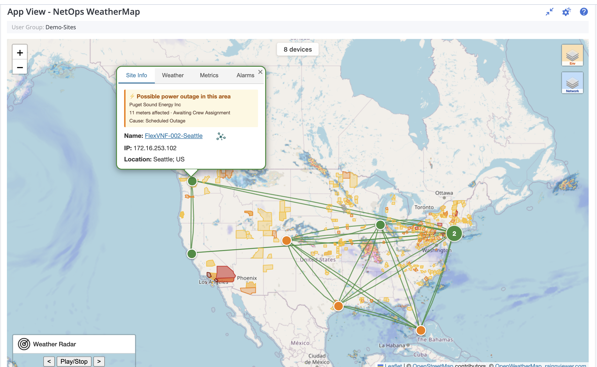

# NetOps WeatherMap — App View for DX NetOps Performance Management

A geographic, single-pane operations view that puts your network **on the
map** — devices, SD-WAN tunnels, AppNeta paths, alarms, weather, and
power-grid events all in one place — so operators can spot what's going
wrong, *where*, in the first second of looking.



---

## Why operators love it

Network outages don't happen in spreadsheets — they happen in places.
A circuit slows down because there's a thunderstorm sitting on top of the
branch. Sites in a metro go dark because a utility cut power for
maintenance. A tunnel between two POPs starts dropping packets after a
provider change. **WeatherMap puts all of that in one view**, so the
operator's first reaction is *"oh, that's why"* instead of *"let me pull
up another tool."*

---

## Features

### See what's down — and where

- **One pin per device, colored by alarm severity.** Critical sites pop
  red the moment DX NetOps sees the event; Major/Minor/Initial roll up
  the same way. No alarm list to scan — the map *is* the alarm list.
- **Marker clustering** at low zoom rolls nearby sites into a bubble
  that inherits the worst severity inside it, so a single red dot at
  continent-scale tells you which region is hurting.
- **Auto-fits to your sites on load** — open the dashboard, see your
  network. No pan-and-zoom dance.

### Understand *why* it's down

- **Live weather overlays** — precipitation, temperature, wind, cloud
  cover — togglable from the layers control. When a branch link
  degrades, you'll see if there's a storm sitting on it.
- **Animated radar playback** — scrub or auto-play the last hour of
  precipitation across your footprint to correlate link events with
  weather fronts moving through.
- **Power-grid outage overlay** — utility-reported outage polygons from
  the public ODIN feed. Click a polygon to see the utility, county,
  meters affected, cause (storm vs scheduled vs equipment), and ETR.
  When a whole metro of devices goes red, this often answers it before
  you've even opened a ticket.

### Single-click drill-down

- **Four-tab device popup** — *Site Info* (name, IP, location,
  power-grid status), *Weather* (live conditions at the site), *Metrics*
  (CPU / Memory / Disk over the dashboard's time window), *Alarms*
  (full active alarm list from DX NetOps Spectrum). All without leaving the map.
- **Deep-link straight to NetOps Triage View** — a topology icon next
  to the device name and an "Investigate in Triage View →" link inside
  the Alarms tab take operators one click from *"the map shows red"* to
  the full per-device drill-down in Performance Center.

### Visualize your SD-WAN, not just your devices

- **SD-WAN tunnel overlay** — every DX NetOps managed SD-WAN
  tunnel between branches drawn on the map as a line between the two
  device pins, **colored by jitter / latency / packet loss** so you can
  see at a glance where the WAN overlay is healthy and where it's
  hurting.
- **Sites legend** with per-device visibility toggles — show only the
  branches you're triaging, hide the rest of the mesh.

### Active synthetic measurements with AppNeta

- **AppNeta Monitoring Points** rendered as bullseye markers right
  alongside your managed devices, with the targets they probe (other
  MPs, ISPs, SaaS endpoints) drawn as globe icons.
- **Per-path lines** colored by jitter, latency, loss, and MOS — the
  same color language as the SD-WAN tunnels, so synthetic-path
  degradation and overlay degradation read the same way at a glance.
- **MP filter** in the legend for narrowing long path lists down to the
  ones you care about.

### Operator-friendly controls

- **Env / Network split layer control** — environmental overlays
  (weather, radar, power outages) and network overlays (SD-WAN tunnels,
  AppNeta paths) toggle independently. You can stack just the layers
  relevant to the question you're asking.
- **Filterable legends** — both the SD-WAN sites legend and the AppNeta
  MPs legend have a search box. Useful when you have hundreds of
  branches or paths and only care about a subset.
- **Plays nicely with NetOps group context** — drop the App View into
  any group-level dashboard and it scopes automatically to the devices
  in that group, respecting whatever group hierarchy your organization
  uses.

---

## Prerequisites

- Node.js 18 or 20
- npm (ships with Node)
- Administrator access to your NetOps Portal for the upload step
- Ability to update the portal's reverse-proxy CSP (typically nginx) —
  see [Portal CSP requirements](#portal-csp-requirements) below
- *(Optional)* An AppNeta tenant + API token, if you want the AppNeta
  Monitoring Points feature

---

## Install

1. **Download** `WeatherMap.zip` from this repository's Releases (or
   build it yourself — see [Build for deployment](#build-for-deployment)).
2. **Log in** to DX NetOps Performance Center as a user with the
   **Administrator** role.
3. **Administration → Configuration Settings → App Deployment.**
4. In the **App** field, browse and select `WeatherMap.zip`, then click
   **Add**. The portal unzips into `/pc/apps/user/WeatherMap/` — no
   restart needed.
5. *(One-time per environment)* Edit the configuration files in the
   unzipped folder for your environment — see
   [Configuration](#configuration).
6. Open or create a **group-level dashboard**, edit it → **Add App
   View** → pick **NetOps WeatherMap** from the dropdown, save. The map
   should auto-zoom to fit your group's devices.

---

## Configuration

All environment-specific values live in files that ship inside
`WeatherMap.zip`. The customer edits these in the unzipped App View
folder — **no rebuild required.**

### `appConfig.properties` — portal-facing metadata

```properties
appName=NetOps WeatherMap
description=...
url=index.html?id={ItemIdDA}&startTime={TimeStartUTC}&endTime={TimeEndUTC}
height=700
supportedContext=nc
```

Controls the iframe URL the portal navigates to (`{ItemIdDA}`,
`{TimeStartUTC}`, `{TimeEndUTC}` are substituted at runtime) and the App
View's display name/height in the portal picker.

### `runtime-config.json` — runtime values

Fetched by the App View at startup. Change a value, save, hard-refresh
the iframe — no build needed.

| Key | Purpose |
|---|---|
| `owmApiKey` | OpenWeatherMap API key for weather overlays and the popup's Weather tab. Get a free key at https://openweathermap.org/api. |
| `mapDefaults.center` / `.zoom` | Initial map view before devices load. Defaults to the continental US. |
| `clusterRadius` | Pixel radius for marker clustering. Lower = clusters break apart sooner as you zoom in. |
| `odata.topLimit` | Maximum devices returned per OData query. |
| `odata.resolution` | OData metric aggregation resolution (e.g. `RATE`, `HOUR`). |
| `powerOutages.apiUrl` | ODIN dataset endpoint for power-outage polygons. Defaults to the public ORNL mirror. |
| `powerOutages.maxRecords` | Pagination cap for ODIN. 5000 covers nationwide storms comfortably. |
| `triageViewPageId` | The Performance Center page id for Triage View in **your** environment. Required for the "Investigate in Triage View" deep-links to appear — set it to whichever page id your portal uses for the Triage View context page. Leave `null` to hide the deep-links. |

### `spectrum-proxy.properties` — Spectrum backend

The Spectrum proxy needs to know where your Spectrum server is and how
to authenticate. **Copy the shipped template and fill it in:**

```bash
cp spectrum-proxy.properties.example spectrum-proxy.properties
# then edit spectrum-proxy.properties — fill in your values
```

| Key | What to set |
|---|---|
| `spectrum.base.url` | Your Spectrum REST URL, e.g. `https://spectrum.example.com:8443/spectrum/` (trailing slash required) |
| `spectrum.user` / `spectrum.password` | Spectrum credentials. Browser never sees them. Auto-obfuscated on disk after the first request (see template comments). |
| `spectrum.ssl.verify` | `true` for production with valid certs, `false` for self-signed dev certs |

### `appneta-proxy.properties` — AppNeta backend *(optional)*

Only needed if you want the AppNeta Monitoring Points feature. Same
pattern as the Spectrum proxy:

```bash
cp appneta-proxy.properties.example appneta-proxy.properties
# then edit appneta-proxy.properties — fill in your values
```

| Key | What to set |
|---|---|
| `appneta.base.url` | Your AppNeta tenant REST URL, e.g. `https://demo.pm.appneta.com/api/` (trailing slash required) |
| `appneta.org.id` | Numeric AppNeta org id. Injected server-side so the App View can't query other orgs. Get this from your AppNeta tenant admin. |
| `appneta.token` | AppNeta API token. Generate in AppNeta UI under user profile → API Access Tokens. Browser never sees it. Auto-obfuscated on disk after first request. |
| `appneta.ssl.verify` | `true` for public AppNeta tenants. Only flip to `false` for on-prem AppNeta with a self-signed cert. |

Changes to either `.properties` file require the servlet container to
recompile the JSP (typically a Tomcat / Jetty restart).

---

## Portal CSP requirements

NetOps Portal sets a strict Content Security Policy on App View
responses that by default blocks the external image / fetch origins
WeatherMap relies on. The portal's reverse proxy (typically nginx)
must override the CSP for App View paths to whitelist these origins.

Inside the nginx `server` block, add this location **before** the
generic `/pc` block:

```nginx
location ~ ^/pc/apps/user/ {
    proxy_set_header X-Forwarded-Host $host;
    proxy_set_header X-Forwarded-For $remote_addr;
    proxy_set_header Host    $host:$server_port;
    proxy_pass https://<backend-host>:443;

    proxy_hide_header Content-Security-Policy;
    add_header Content-Security-Policy "default-src 'self'; script-src 'self' *.ipce.broadcom.com:* 'unsafe-inline' 'unsafe-eval'; connect-src 'self' *.ipce.broadcom.com:* ws: wss: https://api.openweathermap.org https://api.rainviewer.com https://ornl.opendatasoft.com; img-src 'self' data: https://*.tile.openstreetmap.org https://tile.openweathermap.org https://openweathermap.org https://tilecache.rainviewer.com; style-src 'self' 'unsafe-inline'; base-uri 'self'; frame-ancestors 'self'; font-src 'self'; frame-src 'self'" always;
}
```

The whitelisted origins:

| Origin | CSP directive | Why |
|---|---|---|
| `https://*.tile.openstreetmap.org` | img-src | OSM base map tiles |
| `https://tile.openweathermap.org` | img-src | Weather overlay tiles |
| `https://openweathermap.org` | img-src | Weather condition icons in the popup |
| `https://api.openweathermap.org` | connect-src | Current-conditions API |
| `https://api.rainviewer.com` | connect-src | Rainviewer available-timestamps API |
| `https://tilecache.rainviewer.com` | img-src | Rainviewer radar tile images |
| `https://ornl.opendatasoft.com` | connect-src | ODIN power-outage API |

The Spectrum and AppNeta APIs don't need CSP entries — they're proxied
same-origin through the shipped JSPs.

Apply with `sudo nginx -t && sudo systemctl reload nginx`.

---

## Build for deployment

The wrapper script handles build + package + (optional) scp:

```bash
./build.sh                                    # builds + scps to default dev host
SCP_TARGET=user@host:/path ./build.sh         # scp somewhere else
SCP_TARGET=none ./build.sh                    # build only, no scp
```

Or manually:

```bash
npm install
npm run build
rm -rf WeatherMap WeatherMap.zip
mv dist WeatherMap
zip -r WeatherMap.zip WeatherMap
```

Either way produces `WeatherMap.zip`, ready to upload via **Administration →
Configuration Settings → App Deployment** in NetOps Portal.

---

## Local development *(optional)*

```bash
npm install
npm run dev
```

Vite serves the app at http://localhost:8888. Append `?debug=1` to
bypass the OData / Spectrum / AppNeta calls and render sample devices
across the US — useful for visual checks without portal access.

---

## Troubleshooting

**Status banner: "Failed to load runtime-config.json"** — the file is
missing, malformed JSON, or blocked by CSP. Check the browser console.

**Status banner: "No geo-located devices found"** — the group either has
no devices, or none of them have `Latitude` / `Longitude` set in NetOps.

**All markers green / no alarms in popup** — the Spectrum proxy failed.
Open DevTools → Network, look for `spectrum-proxy.jsp`, check the
response. `502 Proxy error` means the JSP reached the backend but
couldn't talk to Spectrum — verify `spectrum-proxy.properties`. `500
Proxy misconfigured` means the JSP couldn't load its properties file.

**No SD-WAN tunnels showing** — the PC OData query returned no tunnels
for the group, or the proxied call failed. Check DevTools → Network for
`/pc/odata4/api/tunnels` and verify the response.

**No AppNeta MPs / paths showing** — open DevTools → Network, look for
`appneta-proxy.jsp`. A 500 usually means `appneta-proxy.properties` is
missing or has a bad token. A 200 with empty results means the
configured org id has no MPs visible to the token's user.

**"Investigate in Triage View" link doesn't appear** —
`triageViewPageId` in `runtime-config.json` is null. Set it to the
Triage View page id for your environment.

**Weather tab says "Couldn't load weather"** — either the OWM API key is
bad (rotate it in `runtime-config.json`) or `https://api.openweathermap.org`
isn't in CSP `connect-src`.

**Weather overlay tiles don't display** — `https://tile.openweathermap.org`
isn't in CSP `img-src`.

**Power Outages overlay shows no count or stays empty** — if the browser
console shows a CSP `connect-src` violation for `ornl.opendatasoft.com`,
the CSP whitelist hasn't been updated for ODIN. Note that ODIN coverage
is voluntary — some utilities (notably FPL in Florida, PG&E in Northern
California) don't participate, so absence of polygons in those areas
may be real, not a bug.

**Gray box instead of a map** — CSP is blocking OSM tiles. Confirm
`https://*.tile.openstreetmap.org` is in the portal's `img-src`.

**Old version showing after redeploy** — the browser caches the iframe's
JS bundle. Hard refresh (Ctrl+Shift+R) or use an incognito window.

---

## Project layout

```
WeatherMap/
├── README.md
├── package.json
├── vite.config.js                      ← base: './' is critical
├── index.html
├── build.sh                            ← build + zip + optional scp
├── docs/
│   └── weathermap-screenshot.png
├── public/                             ← copied verbatim into the zip
│   ├── appConfig.properties
│   ├── runtime-config.json
│   ├── spectrum-proxy.jsp              ← Spectrum same-origin proxy
│   ├── spectrum-proxy.properties.example
│   ├── appneta-proxy.jsp               ← AppNeta same-origin proxy
│   ├── appneta-proxy.properties.example
│   ├── topo-icon.png                   ← Triage View deep-link icon
│   ├── appneta-mp-icon.png             ← AppNeta MP bullseye icon
│   ├── appneta-target-icon.png         ← AppNeta target globe icon
│   └── sample-devices.csv              ← used by ?debug=1
└── src/
    ├── main.jsx                        ← loads runtime-config, mounts React
    ├── App.jsx                         ← map + overlays + data fetches
    ├── App.css
    ├── api/
    │   ├── odata.js                    ← PC devices + metrics
    │   ├── spectrum.js                 ← alarms via proxy
    │   ├── tunnels.js                  ← SD-WAN tunnels via PC OData
    │   ├── appneta.js                  ← AppNeta MPs + paths via proxy
    │   └── odin.js                     ← power outages from ODIN
    ├── hooks/
    │   └── useUrlParams.js             ← parses id, startTime, endTime, debug
    ├── lib/
    │   ├── config.js                   ← runtime-config.json loader
    │   └── leaflet.rainviewer.js       ← vendored Rainviewer plugin
    └── components/
        ├── DeviceMarker.jsx            ← color-by-severity device pin
        ├── TabbedPopup.jsx             ← Site Info / Weather / Metrics / Alarms
        ├── TunnelLayer.jsx             ← SD-WAN tunnel lines
        ├── TunnelLegend.jsx            ← SD-WAN sites legend + filter
        ├── AppNetaLayer.jsx            ← AppNeta MPs + targets + paths
        ├── AppNetaLegend.jsx           ← AppNeta MPs legend + filter
        ├── PowerOutageLayer.jsx        ← ODIN outages as polygons
        ├── RainviewerControl.jsx       ← animated radar bottom-left
        └── Legend.jsx                  ← severity legend (bottom-right)
```
