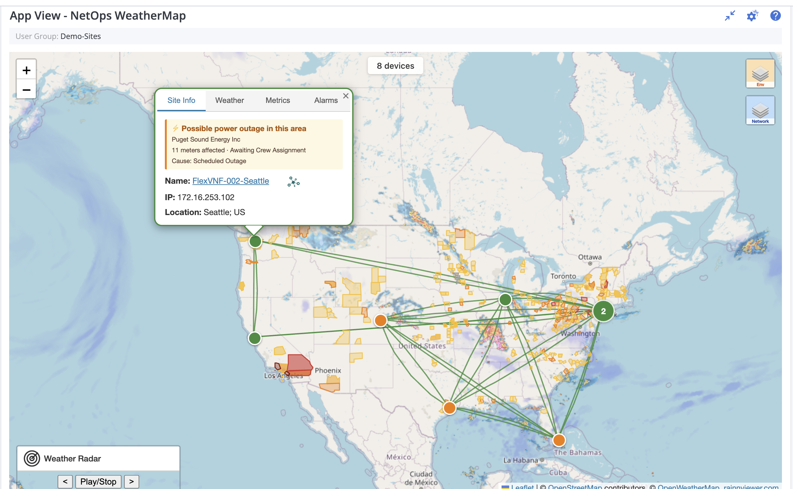

# NetOps WeatherMap — App View for DX NetOps Portal

A geographic, single-pane operations view that puts your network **on the
map** — devices, SD-WAN tunnels, AppNeta paths, alarms, weather, and
power-grid events all in one place — so operators can spot what's going
wrong, *where*, in the first second of looking.



---

## Why operators love it

Network outages don't happen in spreadsheets — they happen in physical places.
A circuit slows down because there's a thunderstorm sitting on top of the
branch. Sites in a metro go dark because a utility cut power for
maintenance. A tunnel between two POPs starts dropping packets after a
provider change. **WeatherMap puts all of that in one view**, so the
operator's first reaction is *"oh, that's why"* instead of *"let me pull
up another tool."*

---

## Features

### See what's down — and where

- **One pin per device, colored by alarm severity.** Critical sites pop
  red the moment DX NetOps sees the event; Major/Minor/Initial roll up
  the same way. No alarm list to scan — the map *is* the alarm list.
- **Marker clustering** at low zoom rolls nearby sites into a bubble
  that inherits the worst severity inside it, so a single red dot at
  continent-scale tells you which region is hurting.
- **Auto-fits to your sites on load** — open the dashboard, see your
  network. No pan-and-zoom dance.

### Understand *why* it's down

- **Live weather overlays** — precipitation, temperature, wind, cloud
  cover — togglable from the layers control. When a branch link
  degrades, you'll see if there's a storm sitting on it.
- **Animated radar playback** — scrub or auto-play the last hour of
  precipitation across your footprint to correlate link events with
  weather fronts moving through.
- **Power-grid outage overlay** — utility-reported outage polygons from
  the public ODIN feed. Click a polygon to see the utility, county,
  meters affected, cause (storm vs scheduled vs equipment), and ETR.
  When a whole metro of devices goes red, this often answers it before
  you've even opened a ticket.

### Single-click drill-down

- **Four-tab device popup** — *Site Info* (name, IP, location,
  power-grid status), *Weather* (live conditions at the site), *Metrics*
  (CPU / Memory / Disk over the dashboard's time window), *Alarms*
  (full active alarm list from DX NetOps Spectrum). All without leaving the map.
- **Deep-link straight to NetOps Triage View** — a topology icon next
  to the device name and an "Investigate in Triage View →" link inside
  the Alarms tab take operators one click from *"the map shows red"* to
  the full per-device drill-down in Performance Center.
- **Click-through from MPs and paths into PC** — AppNeta Monitoring
  Point names link straight to their PC inventory page, and Network
  Path titles link to the per-path detail view in PC. Operators jump
  from *"this path looks bad"* to the full drill-down without leaving
  the map.

### Visualize your SD-WAN, not just your devices

- **SD-WAN tunnel overlay** — every DX NetOps managed SD-WAN
  tunnel between branches drawn on the map as a line between the two
  device pins, **colored by jitter / latency / packet loss** so you can
  see at a glance where the WAN overlay is healthy and where it's
  hurting.
- **Sites legend** with per-device visibility toggles — show only the
  branches you're triaging, hide the rest of the mesh.

### Active synthetic measurements with AppNeta

- **AppNeta Monitoring Points** rendered as bullseye markers right
  alongside your managed devices, with the targets they probe (other
  MPs, ISPs, SaaS endpoints) drawn as globe icons.
- **Per-path lines** colored by jitter, latency, loss, and MOS — the
  same color language as the SD-WAN tunnels, so synthetic-path
  degradation and overlay degradation read the same way at a glance.
- **MP filter** in the legend for narrowing long path lists down to the
  ones you care about.
- **Path popup with PC metadata** — clicking a path line shows the
  geographic route (e.g. `"Miami, FL ↔ Seattle, WA"`), the date PC
  first saw the path, and the live latency / loss / jitter / MOS — both
  the AppNeta-measured metrics and PC's own path inventory in one place.

### Operator-friendly controls

- **Env / Network split layer control** — environmental overlays
  (weather, radar, power outages) and network overlays (SD-WAN tunnels,
  AppNeta paths) toggle independently. You can stack just the layers
  relevant to the question you're asking.
- **Filterable legends** — both the SD-WAN sites legend and the AppNeta
  MPs legend have a search box. Useful when you have hundreds of
  branches or paths and only care about a subset.
- **Plays nicely with NetOps group context** — drop the App View into
  any group-level dashboard and it scopes automatically to the devices
  in that group, respecting whatever group hierarchy your organization
  uses.

---

## Prerequisites

- SSH + sudo access to the NetOps Portal server — also used to make
  the one-time Portal CSP change via `SsoConfig`, see
  [Backend Configuration](docs/BACKEND_CONFIGURATION.md)
- *(Optional)* Access to a Spectrum instance + credentials, for device
  alarm severity coloring. If you don't have Spectrum, WeatherMap
  still renders devices from Performance Center — they just show as
  normal/green instead of colored by alarm severity.
- *(Optional)* An AppNeta tenant + API token, if you want the AppNeta
  Monitoring Points feature

---

## Download

Go to **[this repository's latest release](https://github.com/DXNETOPS-FieldDev/WeatherMap/releases/latest)**
and download the `WeatherMap.zip` file attached to it — that link
always points at the newest release, so it's safe to bookmark.

> ⚠️ **Do not deploy this repository directly.** Cloning this repo or
> using GitHub's **Code → Download ZIP** gives you *source code* that
> has never been built — it will not run, and NetOps Portal won't even
> list it as an App View. Make sure what you're about to deploy is the
> pre-built **`WeatherMap.zip`** from the [Download](#download) section
> above, not a raw clone or source download.
>
> This guide covers downloading, installing, configuring, and running
> WeatherMap from that pre-built release. Building it from source
> yourself (only needed if you're modifying the app) is covered in the
> [Build Guide](docs/BUILD.md).

---

## Install

Deploy directly to the portal server over SSH — this unzips the app
into the portal's user-apps directory.

1. **Know `<PC_HOME>`** — your Performance Center installation root.
   Whoever administers your Performance Center install will already
   know this path; ask them if you're not sure. The apps directory
   you need is `<PC_HOME>/PC/webapps/pc/apps/user`.
2. **Copy and extract the zip:**
   ```bash
   # From your local machine:
   scp WeatherMap.zip <user>@<portal-host>:/tmp/WeatherMap.zip

   # On the portal server:
   cd <PC_HOME>/PC/webapps/pc/apps/user
   sudo unzip -o /tmp/WeatherMap.zip
   ```
   The `-o` flag overwrites existing files — safe for redeploying an
   update.
3. **Verify:**
   ```bash
   curl -sk -o /dev/null -w "%{http_code}" \
     https://<portal-host>/pc/apps/user/WeatherMap/index.html
   ```
   Should return `200`.

If `sudo unzip` leaves files owned by root and the portal needs write
access to them (rare), match the ownership WeatherMap's folder to the
`apps/user` directory it lives in — first check what that already is:
```bash
ls -ld <PC_HOME>/PC/webapps/pc/apps/user
```
Then apply that same user:group to WeatherMap's folder. For example,
if the command above shows `pcuser pcuser` as the owner:
```bash
sudo chown -R pcuser:pcuser <PC_HOME>/PC/webapps/pc/apps/user/WeatherMap
```

Deploys live — no portal restart needed. Once deployed, continue to
[Configure](#configure) before adding it to a dashboard.

---

## Configure

All environment-specific values live in files that ship inside
`WeatherMap.zip`. Edit these directly in the deployed folder —
**no rebuild required**; just save and hard-refresh the dashboard.

### Run `setup.sh` — the fastest way to configure Spectrum, AppNeta, and the Data Aggregator

No Node/npm needed — this is a plain script included in the deployed
folder. It's the recommended way to fill in
`spectrum-proxy.properties`, `appneta-proxy.properties`,
`da-proxy.properties`, and the Triage View page id; the sections below
describe what it writes, in case you'd rather edit a file directly
later.

1. **SSH into the portal server and go to the deployed folder:**
   ```bash
   ssh <user>@<portal-host>
   cd <PC_HOME>/PC/webapps/pc/apps/user/WeatherMap
   ```
2. **Run the script:**
   ```bash
   ./setup.sh
   ```
3. **Answer the prompts.** It walks through, in order:
   - **Spectrum** (required) — REST base URL, username, password, and
     whether to verify Spectrum's TLS certificate.
   - **AppNeta** (optional — say no if you're not using Monitoring
     Points) — REST base URL, organization id, API token, TLS
     verification.
   - **Data Aggregator** (optional, only asked if you configured
     AppNeta — say no if you don't need AppNeta path titles to link
     into PC) — REST URL, your NetOps Portal username/password, TLS
     verification.
   - **Triage View page id** (required for the "Investigate in Triage
     View" links to work) — find this by opening Triage View in your
     Portal and reading the page id out of the URL. Leave it blank to
     hide those links instead.
4. **Restart the servlet container** (Tomcat/Jetty) so the `.properties`
   changes take effect. The Triage View page id applies immediately —
   no restart needed for that one.

Safe to re-run later — it asks before overwriting a file you've
already configured, so answering "no" leaves that file untouched.

### `appConfig.properties` — portal-facing metadata

```properties
appName=NetOps WeatherMap
description=...
url=index.html?id={ItemIdDA}&startTime={TimeStartUTC}&endTime={TimeEndUTC}
height=700
supportedContext=nc
```

Controls the iframe URL the portal navigates to (`{ItemIdDA}`,
`{TimeStartUTC}`, `{TimeEndUTC}` are substituted at runtime) and the App
View's display name/height in the portal picker.

### `runtime-config.json` — runtime values

Fetched by the App View at startup. Change a value, save, hard-refresh
the iframe — no build needed.

**Must change before going live:**
- **`triageViewPageId`** — ships set to a specific dev environment's
  Triage View page id, not a placeholder. Your Performance Center
  instance almost certainly uses a different page id. Until this is
  corrected, "Investigate in Triage View" links point to the wrong
  page (or nowhere). Set it to your own environment's Triage View page
  id, or `null` to hide the deep-links entirely. `setup.sh` (see
  [Backend Configuration](docs/BACKEND_CONFIGURATION.md)) prompts for
  this along with the backend proxy settings.

**Worth checking before going live:**
- **`owmApiKey`** — ships with a shared testing key. Get your own free
  key at https://openweathermap.org/api so weather features aren't
  subject to someone else's rate limit.
- **`odata.topLimit`** — ships at `500`. If your target group has more
  devices than this, they'll be silently truncated. Check your device
  count and raise this if needed.

| Key | Purpose |
|---|---|
| `owmApiKey` | OpenWeatherMap API key for weather overlays and the popup's Weather tab. *Worth checking before going live — see above.* |
| `mapDefaults.center` / `.zoom` | Initial map view before devices load. Defaults to the continental US. |
| `clusterRadius` | Pixel radius for marker clustering. Lower = clusters break apart sooner as you zoom in. |
| `odata.topLimit` | Maximum devices returned per OData query. *Worth checking before going live — see above.* |
| `odata.resolution` | OData metric aggregation resolution (e.g. `RATE`, `HOUR`). |
| `powerOutages.apiUrl` | ODIN dataset endpoint for power-outage polygons. Defaults to the public ORNL mirror. |
| `powerOutages.maxRecords` | Pagination cap for ODIN. 5000 covers nationwide storms comfortably. |
| `triageViewPageId` | The Performance Center page id for Triage View in **your** environment. **Must change before going live — see above.** Leave `null` to hide the deep-links. |

### Backend connections and Portal CSP

WeatherMap reaches Spectrum (required), and optionally AppNeta and the
Data Aggregator, through same-origin JSP proxies shipped inside the
zip. Wiring those up — and the one-time nginx CSP change your portal
needs for the weather, radar, and power-outage overlays to load — is
covered in **[Backend Configuration](docs/BACKEND_CONFIGURATION.md)**.

At minimum, configure the Spectrum proxy before going live. AppNeta and
the Data Aggregator deep-link are optional.

---

## Run

1. Open or create a **group-level dashboard** in NetOps Portal.
2. Edit it → **Add App View** → pick **NetOps WeatherMap** from the
   dropdown → save.
3. The map should auto-zoom to fit your group's devices.

**Smoke test before wiring up real credentials:** append `?debug=1` to
the App View's URL to render sample devices across the US without
hitting Spectrum, PC OData, or AppNeta at all. If you see a populated
map with `?debug=1` but a blank one without it, the deployment itself
is fine and the issue is in your backend configuration — see
[Backend Configuration](docs/BACKEND_CONFIGURATION.md).

---

## Troubleshooting

Issues with Spectrum, AppNeta, or Data Aggregator proxies, or with the
portal's Content-Security-Policy, are covered in
[Backend Configuration](docs/BACKEND_CONFIGURATION.md#troubleshooting)
instead of here.

**Status banner: "Failed to load runtime-config.json"** — the file is
missing, malformed JSON, or blocked by CSP. Check the browser console.

**Status banner: "No geo-located devices found"** — the group either has
no devices, or none of them have `Latitude` / `Longitude` set in NetOps.

**No SD-WAN tunnels showing** — the PC OData query returned no tunnels
for the group, or the proxied call failed. Check DevTools → Network for
`/pc/odata4/api/tunnels` and verify the response.

**"Investigate in Triage View" link doesn't appear** —
`triageViewPageId` in `runtime-config.json` is null. Set it to the
Triage View page id for your environment.

**Weather tab says "Couldn't load weather"** — either the OWM API key is
bad (rotate it in `runtime-config.json`), or your portal's CSP isn't
whitelisting OpenWeatherMap — see
[Backend Configuration](docs/BACKEND_CONFIGURATION.md).

**Power Outages overlay shows no count or stays empty** — first check
whether your portal's CSP allows the ODIN API (see
[Backend Configuration](docs/BACKEND_CONFIGURATION.md)). If CSP is fine,
note that ODIN coverage is voluntary — some utilities (notably FPL in
Florida, PG&E in Northern California) don't participate, so absence of
polygons in those areas may be real, not a bug.

**Old version showing after redeploy** — the browser caches the iframe's
JS bundle. Hard refresh (Ctrl+Shift+R) or use an incognito window.

---

## Data Sources & Attributions

WeatherMap displays data from several third-party services. Some require
visible attribution as a condition of their free API terms; others are
credited as a courtesy.

| Source | Used for | Attribution |
|---|---|---|
| [OpenStreetMap](https://www.openstreetmap.org/copyright) | Base map tiles | Required by OSM's tile usage policy. Shown in the map's attribution corner whenever the map is displayed. |
| [OpenWeatherMap](https://openweathermap.org/) | Precipitation / temperature / wind / clouds overlays, current-conditions popup | Required by OWM's terms. Shown in the map's attribution corner while any weather overlay is active. |
| [RainViewer](https://www.rainviewer.com/) | Animated radar playback | Required under RainViewer's free API terms ("Weather data by RainViewer" with a link back to rainviewer.com). Shown in the map's attribution corner while the radar overlay is active. |
| [ODIN](https://ornl.opendatasoft.com/) (DoE / Oak Ridge National Laboratory) | Power-grid outage overlay | Courtesy credit — no explicit attribution requirement was found in ODIN's published terms. |

Software licenses for the open-source libraries WeatherMap is built on —
including two items flagged for legal review — are in
**[LICENSE.md](LICENSE.md)**.
